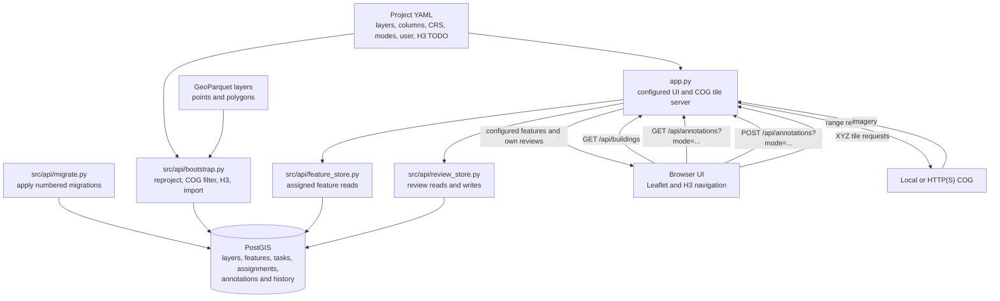
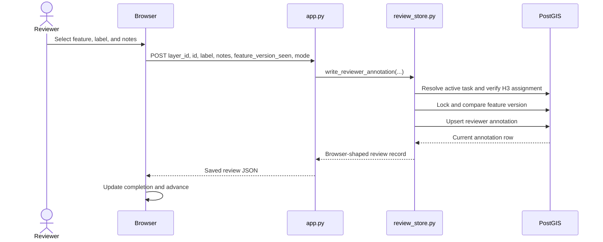
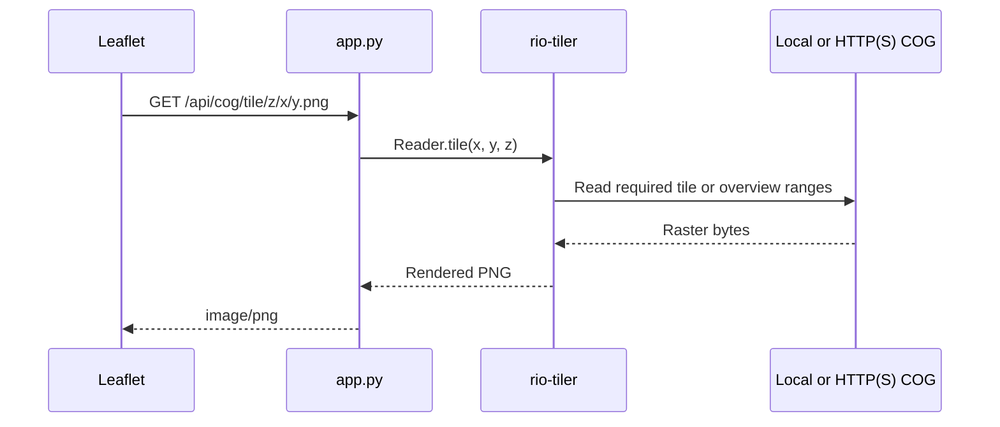

# Application Flow

The application is YAML-configured and PostGIS-backed. Independent point and
polygon GeoParquet layers initialize the database; reviewer clients never edit
object-storage files directly.

## Runtime Flow

## Annotation Save Sequence

Annotation tasks are layer-specific. The database unique key also includes
reviewer identity, allowing multiple reviewers to annotate the same feature
without overwriting each other.

## COG Tile Sequence

Geometry/property editing will use the existing versioned FastAPI endpoint,
but it is not yet exposed by the browser UI.
