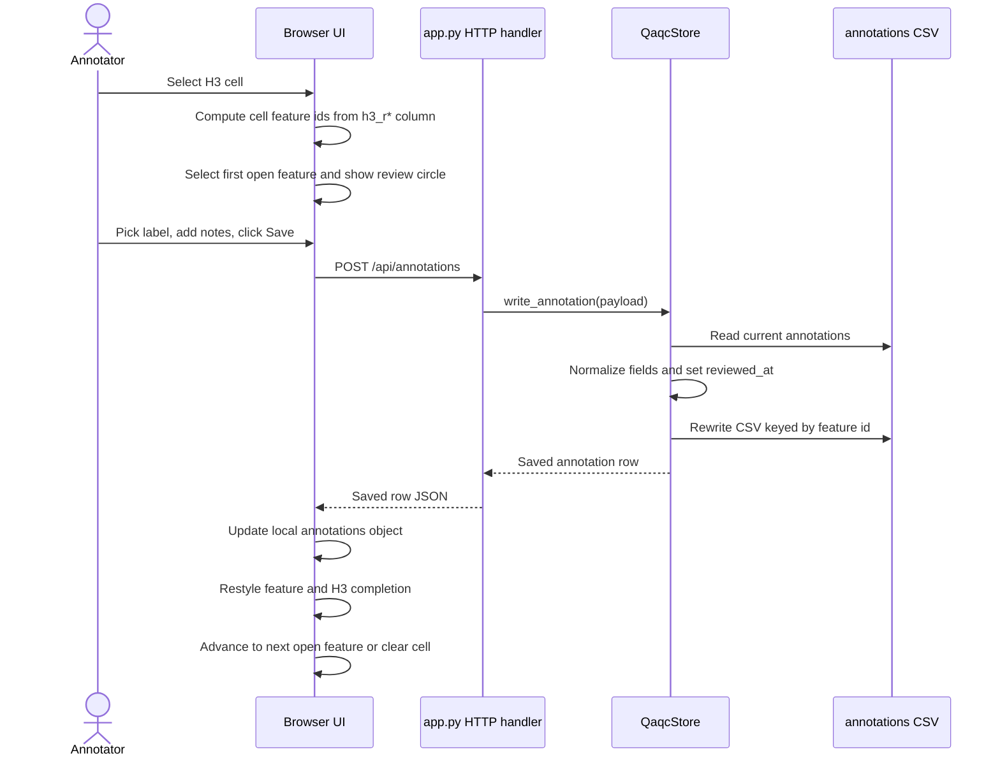
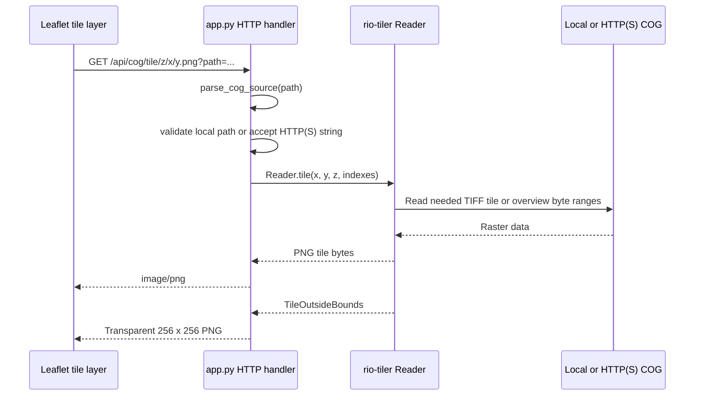

# Application Flow

This document describes the local QA/QC annotation app at a system level. The
same flow is rendered as a vector PDF in `flow_chart.pdf` for easier zooming and
scrolling.

## Runtime Flow

```mermaid
flowchart TD
    user["Annotator"]

    subgraph Prep["Optional data preparation"]
        rawGeojson["Polygon or multipolygon GeoJSON<br/>EPSG:4326, id field"]
        addH3["src/add_h3_indexes.py<br/>adds h3_r5 through h3_r10 columns"]
        h3Geojson["Feature GeoJSON used by app"]
        sourceTiffs["Source GeoTIFF tiles"]
        buildCog["src/build_cog.py<br/>gdalbuildvrt then gdal_translate -of COG"]
        cogFile["COG imagery<br/>local path or HTTP(S) URL"]

        rawGeojson --> addH3 --> h3Geojson
        sourceTiffs --> buildCog --> cogFile
    end

    subgraph Server["Python server: app.py"]
        main["main()"]
        parser["build_parser()<br/>--host, --port, --buildings, --annotations"]
        store["QaqcStore<br/>buildings_path, annotations_path"]
        httpServer["ThreadingHTTPServer<br/>make_handler(store)"]

        routeRoot["GET /<br/>Handler.app_html()"]
        routeBuildings["GET /api/buildings?path=..."]
        routeAnnotationsGet["GET /api/annotations"]
        routeAnnotationsPost["POST /api/annotations"]
        routeCogInfo["GET /api/cog/info?path=..."]
        routeCogTile["GET /api/cog/tile/z/x/y.png?path=..."]

        readBuildings["QaqcStore.read_buildings()<br/>json.load(feature GeoJSON)"]
        readAnnotations["QaqcStore.read_annotations()<br/>csv.DictReader keyed by id"]
        writeAnnotation["QaqcStore.write_annotation()<br/>normalizes fields, sets reviewed_at,<br/>rewrites annotation CSV"]

        parseCog["parse_cog_source()<br/>HTTP(S) string, local Path, or None"]
        cogExists["cog_source_exists()<br/>remote strings pass, local paths must exist"]
        cogInfo["cog_info()<br/>rasterio.open, transform bounds to EPSG:4326"]
        renderTile["render_cog_tile()<br/>rio-tiler Reader.tile(x, y, z)"]
        emptyTile["empty_png_tile()<br/>transparent 256 x 256 PNG for TileOutsideBounds"]
    end

    subgraph Files["Local files and remote assets"]
        geojsonFile["Feature GeoJSON<br/>id, geometry, h3_r5...h3_r10,<br/>optional label/confidence fields"]
        annotationsCsv["Annotation CSV<br/>id, predicted_class, annotation_label,<br/>qa_status, qa_correct_class, qa_notes,<br/>reviewer, reviewed_at"]
        cogAsset["COG raster<br/>GeoTIFF tiles and overviews"]
    end

    subgraph Browser["Browser UI: Leaflet, h3-js, localStorage"]
        loadPage["Load page from /"]
        defaults["Default paths injected into HTML<br/>saved settings restored from localStorage"]
        init["init()"]
        loadAnnotations["loadAnnotations()<br/>fetch existing annotations"]
        loadBuildings["loadBuildings()<br/>fetch feature GeoJSON"]
        updateCogLayer["updateCogLayer()<br/>fetch COG info, create Leaflet tile layer"]
        renderFeatures["renderFeatureLayer()<br/>filter features, build Leaflet GeoJSON layer"]
        updateH3Grid["updateH3Grid()<br/>choose H3 resolution from zoom,<br/>aggregate completion by cell"]
        selectCell["selectCellFeature()<br/>lock selected H3 cell,<br/>choose first open feature"]
        selectFeature["selectFeature()<br/>show selected id, notes, label buttons,<br/>green review circle"]
        saveClick["Save Annotation click<br/>build annotation payload"]
        clientUpdate["Update client state<br/>restyle features, refresh H3 grid,<br/>advance to next open feature"]
        settings["Settings Load click<br/>update paths, labels, COG, confidence filter,<br/>persist to localStorage"]
        zoom["Map zoomend<br/>recompute H3 grid resolution"]
        escape["Escape key<br/>clear selected H3 cell"]
        tileLayer["Leaflet COG tile layer<br/>requests XYZ PNG tiles"]
    end

    main --> parser
    main --> store
    main --> httpServer

    user --> loadPage
    loadPage -->|GET /| routeRoot
    routeRoot -->|HTML with defaults| defaults
    defaults --> init

    init --> loadAnnotations
    loadAnnotations -->|GET /api/annotations| routeAnnotationsGet
    routeAnnotationsGet --> readAnnotations
    readAnnotations --> annotationsCsv
    annotationsCsv --> readAnnotations
    readAnnotations -->|annotations JSON| loadAnnotations

    init --> loadBuildings
    loadBuildings -->|GET /api/buildings?path=...| routeBuildings
    routeBuildings --> readBuildings
    readBuildings --> geojsonFile
    geojsonFile --> readBuildings
    readBuildings -->|FeatureCollection JSON| loadBuildings
    loadBuildings --> renderFeatures
    renderFeatures --> updateH3Grid

    init --> updateCogLayer
    updateCogLayer -->|GET /api/cog/info?path=...| routeCogInfo
    routeCogInfo --> parseCog --> cogExists --> cogInfo
    cogInfo --> cogAsset
    cogAsset --> cogInfo
    cogInfo -->|width, height, CRS, WGS84 bounds| updateCogLayer
    updateCogLayer --> tileLayer
    tileLayer -->|GET /api/cog/tile/z/x/y.png?path=...| routeCogTile
    routeCogTile --> parseCog
    routeCogTile --> renderTile
    renderTile --> cogAsset
    renderTile -->|PNG tile| tileLayer
    renderTile -->|TileOutsideBounds| emptyTile
    emptyTile -->|transparent PNG tile| tileLayer

    updateH3Grid --> selectCell
    renderFeatures --> selectFeature
    selectCell --> selectFeature
    selectFeature --> saveClick
    saveClick -->|POST /api/annotations| routeAnnotationsPost
    routeAnnotationsPost --> writeAnnotation
    writeAnnotation --> readAnnotations
    writeAnnotation --> annotationsCsv
    writeAnnotation -->|saved row JSON| clientUpdate
    clientUpdate --> updateH3Grid
    clientUpdate --> selectFeature

    settings --> loadBuildings
    settings --> renderFeatures
    settings --> updateCogLayer
    zoom --> updateH3Grid
    escape --> updateH3Grid

    h3Geojson -->|provided as app input| geojsonFile
    cogFile -->|provided as app input| cogAsset
```

## Annotation Save Sequence

## COG Tile Sequence

